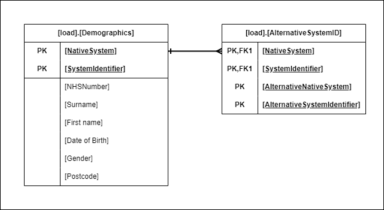

# Warehouse-Master-Patient-Index

Welcome to the official GitHub repository for the Somerset NHS Foundation Trust Warehouse Master Patient Index (WMPI).

This repo aims to describe the algorithm used as part of the matching process within the SomersetFT’s WMPI solution.

## Table of Contents
* [Background](#background)
* [Matching Algorithm](#matching-algorithm)
	* [Algorithm Description](#algorithm-description)
	* [Indirect Matches](#indirect-matches)
	* [Flow Diagrams](#flow-diagrams)
	* [Examples](#examples)
		* [No Match](#no-match)
		* [1:1 Confident Match](#confident-match)
		* [1:1 Unconfident Match](#unconfident-match)
		* [Multiple Match](#multiple-match)
		* [Indirect Match](#indirect-match)
	* [DBS Validation](#dbs-validation)
* [Table Structures](#table-structures)
* [License](#license)
* [Acknowledgments](#acknowledgments)
 
## Background
The Trust has many clinical systems, most of which hold their own, independent patient datasets. These can be structured very differently depending on how the application works but all store the same basic demographic information. 

Within our warehouse environment we wanted to create a solution that:

- Provides a single repository of patient demographic data from systems across the trust
- Identifies common patient records, both across systems and in a single system (duplicates)
- Complies with data governance expectations. Particularly surrounding the linking patient records
- Is scalable and can process the ever-increasing number of systems and patient records

At the heart of this sits a matching algorithm that uses a specific subset of core demographic data items to _match_ all patient records within the repository.

It’s this matching algorithm that we hope to showcase within this GitHub repository.

## Matching Algorithm
### Algorithm Description
The matching algorithm uses a core set of 6 patient demographic data items and an additional system specific identifier:

- NHS Number
- First name
- Surname
- Date of birth
- Gender
- Postcode
- Patient identifier from one system stored in another system (AlternativeSystemID)

These data items are combined in 7 different combinations and each given a number:
- 2 - NHS Number
- 3 - AlternativeSystemID
- 4 - First name, Surname, Date of birth, Gender, Postcode
- 5 - First name, Surname, Date of birth, Gender
- 6 - Surname, Date of birth, Gender, Postcode
- 7 - First name (punctuation + spaces removed), Surname (punctuation + spaces removed), Date of birth, Gender, Postcode
- 8 -  First name Soundex, Surname Soundex, Date of birth, Gender, Postcode

Each patient record is joined into the full patient dataset using the above combinations in turn. Any resulting matched records are stored, along with the coded numerical _match type_. In some instances an **a** or **e** is also used as part of the match type to imply a further match on date of birth is present.

Then, for each patient record, the matching records and match types are aggregated to give a complete set of matching records. _Indirect matches_ (see [indirect matches](#indirect-matches)) are then identified and added into the matching record set. 

Finally, from this we are able to generate a high level matching status for each patient record with each matching system. We categorise these into:

- **1:1 confident match** (1 matching record with 2a or 4 or 7. Alternatively at least one matching record with 3a)
- **1:1 unconfident match** (1 matching record with any match type other than that in a 1:1  confident match)
- **multiple match** (>1 matching record with any match type other than a 3a)
- **no match** (no matching records returned)

In addition, duplicate records within a single system are identified where any matches are returned from the same source system.

### Indirect Matches
Indirect matches occur when two patient records are not directly matched through the algorithm but are related through a match to another common record.

For example:

Patient record 1:
|PatientID|NHSNumber|First name|Surname|Date of Birth|Gender|Postcode|
|--|--|--|--|--|--|--|
|1|1111111111|John|Doe|01-01-2000|1|ZZ1 1AA|

Would match, through the algorithm (_2e_ match), to patient record 2:
|PatientID|NHSNumber|First name|Surname|Date of Birth|Gender|Postcode|
|--|--|--|--|--|--|--|
|2|1111111111|John|Doe|02-01-2000|1|ZZ1 1AA|

However, patient record 3 matches to record 2 through the algorithm (_4,5,6,7,8_ match), but not to record 1:
|PatientID|NHSNumber|First name|Surname|Date of Birth|Gender|Postcode|
|--|--|--|--|--|--|--|
|3|NULL|John|Doe|02-01-2000|1|ZZ1 1AA|

This means that, through the algorithm alone, record 1 and record 3 are not picked up as a match. To get around this, a process is run to identify these and create a new, indirect (_INDRT_) match between these two records. This is considered an unconfident match.

### Flow Diagrams
A visual representation of the matching algorithm can be found [here](/WMPIAlgorithm_v308.pdf).

### Examples
The following examples use fictional patient data to demonstrate how the matching algorithm works in each given matching scenario. For demonstration purposes, the number of systems shown are limited but the principle remains the same, regardless of the number of systems matched.

#### No Match
#### Confident Match
#### Unconfident Match
#### Multiple Match
#### Indirect Match

### DBS Validation
The [Demographics Batch Service](https://digital.nhs.uk/developer/api-catalogue/demographics-batch-service) provided by NHS Digital is used to validate a subsection matches identified through the matching algorithm. 

The demographic data items for records involved in either an **unconfident** or **multiple** match are submitted to the Spine for tracing against the [Personal Demographics Service (PDS)](https://digital.nhs.uk/services/personal-demographics-service).

Where a trace is successfully returned for both records in a match, the returned NHS Numbers are compared and, where they are not equal, the match is _"undone"_ as they are considered different patients. Where the returned NHS Numbers are the same, the match is considered confirmed.

Should at least one record in the matching pair return an unsuccessful trace then we have no additional information to either confirm or deny the match, so the algorithm outputs remain. The untraced records are sent for data quality review. 

## Table Structures
The below gives an example of the input (load), core and output table structures used in the SomersetFT WMPI solution. A accompanying data dictionary is also given for each table.
#### Input (load)
These are the data items sourced directly from the source system.

**[load].[Demographics]**
|Column Name|Description|
|--|--|
|[NativeSystem]|Local lookup ID for the native system in which the patient record belongs.|
|[SystemIdentifer]|Local patient ID from the source system.|
|[NHSNumber]|Demographic data item from the source system.|
|[Surname]|Demographic data item from the source system.|
|[Firstname]|Demographic data item from the source system.|
|[DateOfBirth]|Demographic data item from the source system.|
|[Gender]|Demographic data item from the source system.|
|[Postcode]|Demographic data item from the source system.|

**[load].[AlternativeSystemID]**
|Column Name|Description|
|--|--|
|[NativeSystem]|ID for the native system in which the patient record belongs. Referenced in ref.System|
|[SystemIdentifier]|Local Patient ID within the NativeSystem|
|[AlternativeNativeSystem]|ID for the native system in which the AlternativeSystemID belongs. Referenced in ref.System|
|[AlternativeSystemIdentifier]|Alternative Local Patient ID within the AlternativeNativeSystem|

#### Core

#### Output

## License

## Acknowledgments
